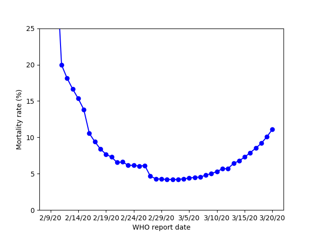

## Recreating COVID-19 charts with Johns Hopkins CSSE data and matplotlib

There are many graphs and charts produced for news articles that are "frozen"
in time. This repo attempts to re-create those graphs and charts but with
updated versions as more data become available.

I've chosen to use the [Johns Hopkins CSSE COVID-19 repo](https://github.com/CSSEGISandData/COVID-19)
as source for all data. Mostly because it's convenient but also because a lot
of people seem to use it already.

### Articles

The Lancet [Real estimates of mortality following COVID-19 infection](https://www.thelancet.com/journals/laninf/article/PIIS1473-3099(20)30195-X/fulltext) has one Figure which includes data from 2020-02-11 to 2020-03-01.

and here is the same graph (almost. I don't have the WHO estimates) with more dates added. The source code to produce this figure is in `lancet1.py`.

